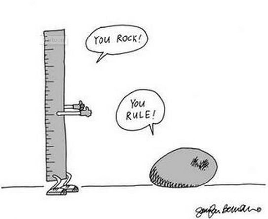

## Simple and Powerful
Are the first two words that come to mind when I think about Semantic UI, a framework for developing and designing websites. These past two weeks have been a sort of trial by fire for me and semantic ui was my saving grace. A little over a week ago I started to learn HTML and CSS, the foundations of the internet. **OK**. They're not really the foundations of the internet, but the average person is generally never exposed to anything besides the pretty front end of a website. The *A e s t h e t i c* of a site is the first thing a new user judges a website on and (if you were wondering) my beginner websites with pure html and css looked like it'd give your computer a disease. This is where semantic ui comes in to save the day. Straight out of the box I was able to design and recreate websites that were visually appealing without too much effort and time as a beginner! It was a huge step up from my previous attempts. Semantic UI made adding and formatting content a breeze.

## The Learning Process
Learning Semantic UI to use with HTML and CSS was a hit or miss experience at first. Getting the Semantic UI to play nice with my HTML/CSS was a struggle at first, but is progressively becoming easier. Learning Semantic Ui is for sure a fair amount of effort as it does introduce many new concepts and variations, but it's worth the time to learn for the exact same reasons that make it hard. The effort put into learning Semantic UI is rewarded with a streamlined process to design websites. The one downside to this is that unless you put the effort into customizing your site while using the semantic framework, you can end up with a site that looks blends into the sea of modern websites. However, with enough effort and customization you can have your very own beautiful and personalized site for any use.

## The Future of Frameworks
While I do very much enjoy using Semantic UI, I believe that it is very important to have a strong background knowledge of both HTML and CSS. If I were to call myself a web designer right now because I can make pretty-ish websites using Semantic UI, I'd be in way over my head. HTML and CSS offer much more customization and flexibility than what can be provided with only one framework. As new frameworks come out there will always be a flavor of the month, but a strong working knowledge of the basics can replicate what any frameworks new and old can do. However, this doesn't mean you have to choose between using or not using frameworks. UI frameworks very helpful and can be combined with your expertise in HTML and CSS to create websites faster, more attractive, and with less effort! 

