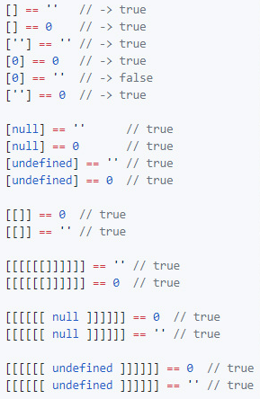

## "JavaScript is Trash"
If you've ever browsed around or talked to other programmers that use JavaScript, then you may have been told to avoid JavaScript like the plague(at least I have). Going into learning JavaScript, I was mentally prepping myself for the worst. However, as I started making my way through the free module on basic JavaScript at [freeCodeCamp](https://www.freecodecamp.org/), I found it much more intuitive and straightforward than what I had been led to believe. Having already been exposed to some of the other basic languages, I had no difficulties in picking up JavaScript and furthermore I was able to quickly create functioning code even before I had finished the module!
At least for me, learning and using JavaScript was simple and easy. I would definitely recommend picking it up if you are new to programming.

## Practicality
I love JavaScript for simple projects, but I can't imagine having to use it for anything large. While JavaScript is fairly simple, it has certain 'quirks' to it that could potentially lead to a frustrating time. One quirk that immediately comes to mind is the difference between "==" and "===". In JavaScript using "==" will compare two things, but not necessarily their types. For instance: Comparing the integer '1' and the string "1" (1 == "1") would return true, whereas it would return false if one were to use "===". JavaScript in my opinion, is a tool that designers and newcomers can easily pick up to do front end development. For more intensive projects, using "beefier" programming languages such as Java or C would be better due to having more precise control. "C does whatever you tell it to." 

## WOD Are You Up To?
WOD or "Workout of the Day" is a term that is used in crossfit. For our ICS 314 class we use it as a term to describe simple timed exercises to help prep us to program under pressure. Thus far, these WODs have helped me to quickly put my ideas for solving a problem into a practical medium. It is easy to come up with an answer to these WODs, but to transform theory into code is what these WODs really shine for. It may be stressful, but in the end it helps to keep me on my toes. I would recommend trying your own WODs at home by choosing a problem, setting a timer, and coding a solution within a set timeframe. The more you practice, the better you will become!
