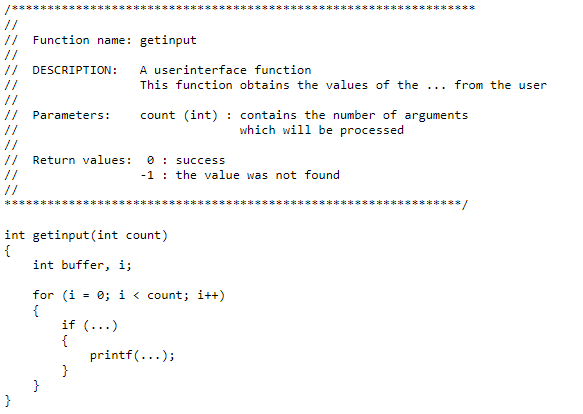

## It Doesn't Matter
How your code looks... at least to the computer. You can write your whole program on one disgusting line if that's what you want. I don't care. You probably don't care either if that's what you're doing in the first place. However, if you do want others to care about what you're writing then perhaps looking into "Coding Standards" is a good place to begin. If you're a beginner programmer or just starting to learn the basics of computer science then you may not yet have been exposed to what has come to be known as "Coding Standards." What is it? Simply put, it's a set of "self" imposed(or by your boss/client) rules in order to keep your code readable and standardized across different versions. 

## Don't Listen To What They Tell You
There isn't only one correct style. Some people might be fervishly convicing you that four spaces is the correct way to indent or that tab is the only way, but ultimately it comes down to what you or your clients prefer and **consistency**. For example, whilst working on my projects for my C programming class, my professor was extremely particular about the style of coding we used. This included: ABSOLUTELY 4 spaces to indent(no more or no less), close-curly-braces had to be on the second line of each function by itself and alligned with the closing brace, and comments must be done block style before every function and at the beginning of the program. **Always** use the coding standard your client wants you to use, but when it comes to your own projects you can do whatever you want to. I personally prefer my code to be aesthetic and neat, but not nearly as strict as the example above. What kind of style have you developed?  

## ESLint
Lately I've been using ESLint, a tool that identifies patterns to help maintain the quality of your code. It's been an interesting experience.

