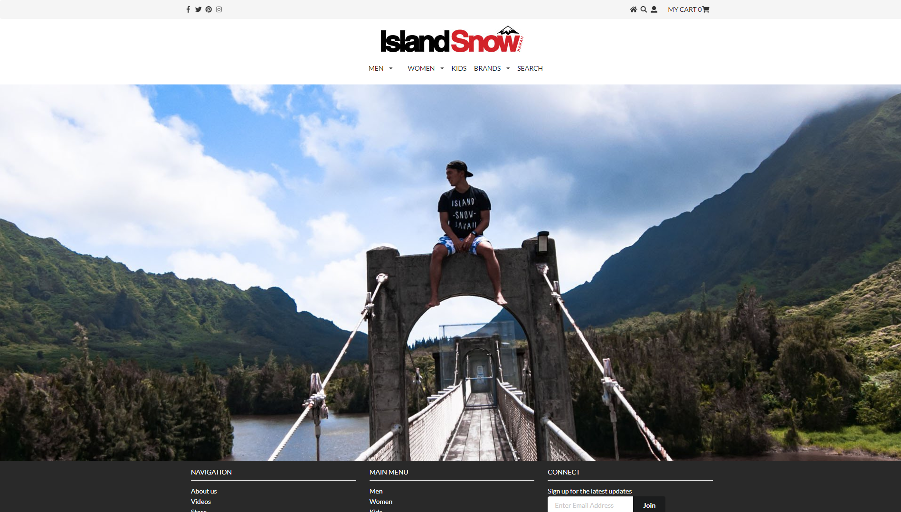
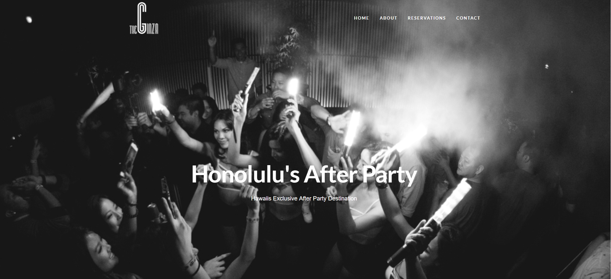

Below are a couple of my recreations that I have done. Using a combination of different frameworks including Semantic UI, React, and Meteor I was able to essentially copy the look of these websites to hone my skill. The websites I chose in order are: [Hard Rock Cafe](http://www.hardrock.com/cafes/honolulu/), [Island Snow](https://islandsnow.com/), and [Ginza Nightclub](http://www.ginzanightclub.com/#intro-shift). Overall these websites were not the hardest to recreate, but they were fun to make and good practice.

This first picture is a recreation of the top portion of the Hard Rock Cafe in Honolulu's home page. The current page compared to my recreation has more clutter on it, so I decided to clean it up a little bit to be more aesthetically pleasing.

This second picture is a recreation of the top and footer of the IslandSNow website. I found this to be a bit more interesting to make because it has two separate menus which was fun to make. 

The last picture is of the top portion of Ginza's website. I attempted to create this with react and meteor. It would probably have been better to not try to incorporate react at all when making this as it made it substantially more difficult formatting the site. The design is simple and clean, so I did eventually end up liking how it turned out.

