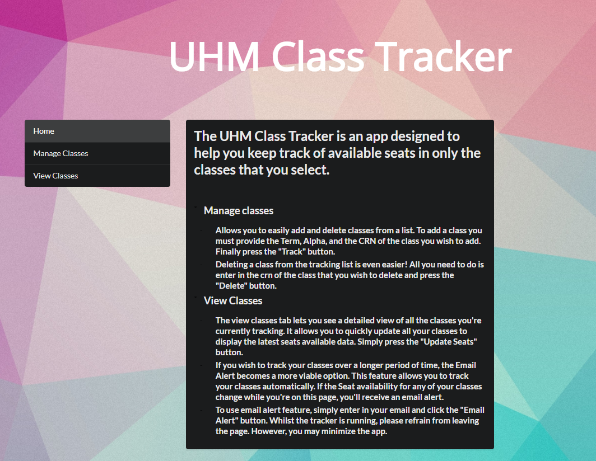
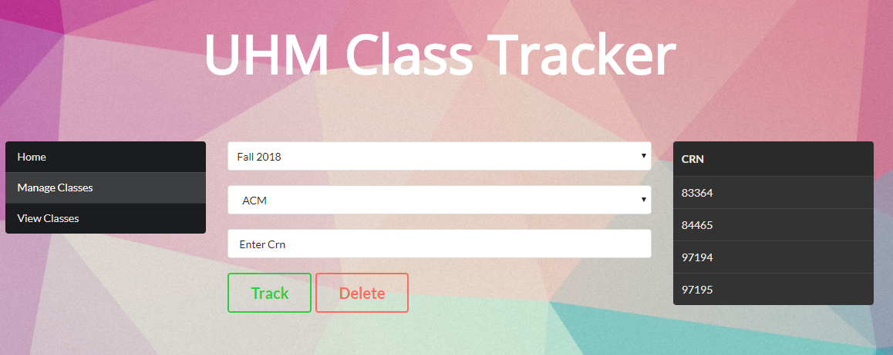
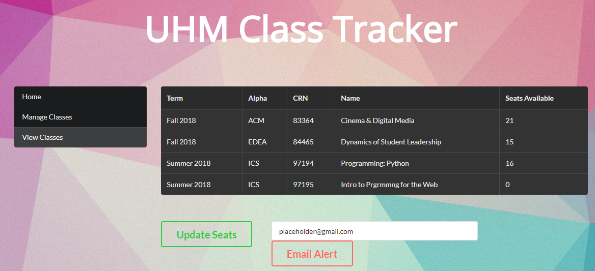

## UHM Class Tracker

UHM Class Tracker is an application that allows users to track seat availability of classes at UH Manoa either instantly or 
over a long period of time. This application is convenient because minimizes the actual tracking work the user has to do once it is set up and eliminates the need to navigate between many different web pages each time a user wants to track a class by displaying all their tracked classes in one convenient location.
The application works by accepting user input, scraping the official UH Manoa class availbility site, storing
the data into an oracle DBMS, and then displaying it in a table. The application also supports email notifications whenever
the seat availability of any of your tracked classes change. This web application was created using JSF(Java Server Faces), Java, and
OracleDB.

## Video Preview
A video overview can be seen [here](https://www.youtube.com/watch?v=BQGujdpAcMc)

