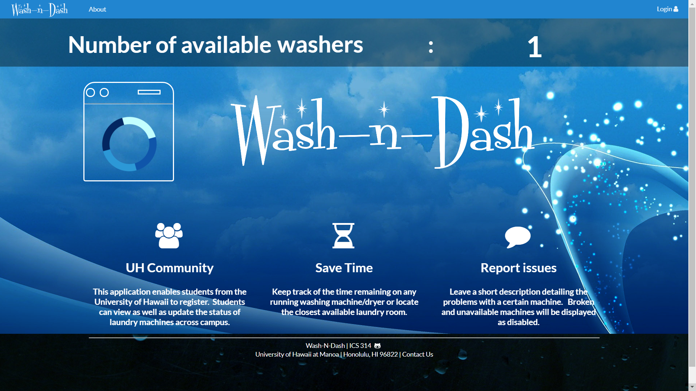
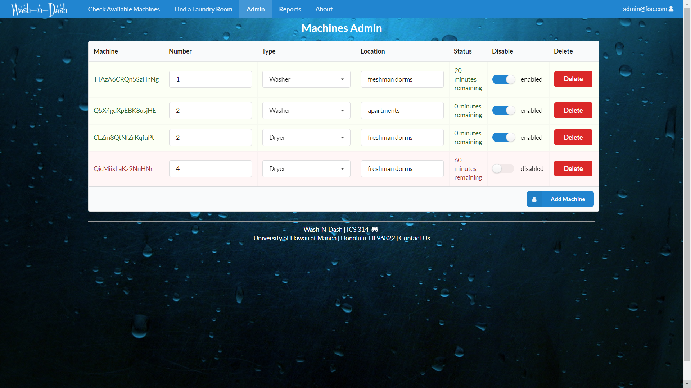

## Wash-N-Dash
Wash-N-Dash is an app made by students for students. Wash-N-Dash allows UH Manoa students to track the progress of their
laundry from anywhere, find laundry rooms, and filter out different machines based on location or type. The app also includes
reporting features and administrator management tools. Wash-N-Dash was built using the Meteor framework and ReactJs. The application works
by detecting which machines are currently in use by either user reporting or a raspberry pi and giving an estimated time of completion. 
This project allowed me to experience working in a small team and practice various project management techniques which included:
issue based development, version control, resolving merge conflicts, and peer code reviews.

## Contributors:

Riley Cammack (CENG): rcammack@hawaii.edu
ice cream enthusiast
Justin Pham (CS): jpham79@hawaii.edu
Student by day, gamer by night
Olivia Murray (CS): omurray4@hawaii.edu
Student, gamer, and derby girl
David Badke (CS): @hawaii.edu
Mysterious motercycle/hacker dude

## Wash-N-Dash Github Page
Setup, code, and previews of the application can be seen [here](https://wash-n-dash.github.io/)

