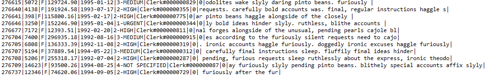

For this I was given a skeleton by Professor Lipyeow Lim and am using it currently to develop a CSV File Reader. Thus far it is able to search through CSV files in a certain format and return rows of data that either match the given paramaters or exceed the given parameters based on which commands are called. The idea behind the project was to implement effecient ways to process files that are too large to be stored in memory, so three different approaches were taken: Using a filereader and processing the content character by character, Using a bufferedreader and processing the content line by line, Using a compression library to encode the file and then process it byte by byte.   

The source code can be found [here](https://github.com/jpham79/CSV-File-Reader).
