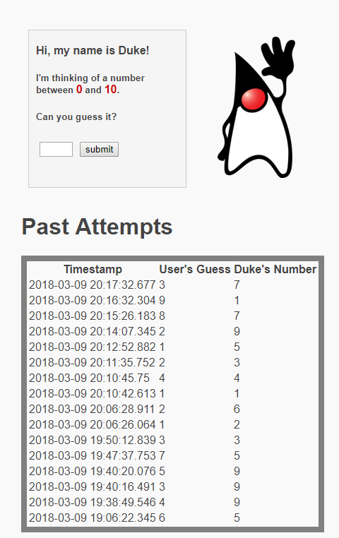

The base of this project was done by following the JSF [tutorial](https://netbeans.org/kb/docs/web/jsf20-intro.html) provided by netbeans.
The result of the tutorial was a working guessing game using JSF. After that I decided to add more functionality to the game by storing
the user's guess, the correct answer, and the time of each guess in a database and displaying it to the user.
In order to accomplish this I created a database using the prepackaged JavaDB that comes with Netbeans. The program works by taking the
user input, comparing it to a random number(Duke's Number) and then inserting the attempt into the database using an SQL statement.
A table is then shown to the user by performing an SQL query and storing the results into an ArrayList of Attempts and displaying it.

The source code can be found [here](https://github.com/jpham79/GuessANumberWebApp).

